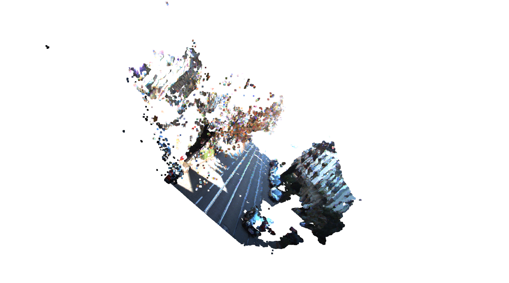

# Depth Estimation from Stereo Images



This project implements depth estimation and 3D point cloud visualization from stereo images using the KITTI dataset.

## Features

- Compute depth maps from stereo image pairs
- Generate colored 3D point clouds from depth maps
- Visualize point clouds in the camera coordinate frame

## Requirements

- Python 3.x
- OpenCV
- NumPy
- Open3D

## Installation

```bash
pip install opencv-python numpy open3d
```

## Usage

Run the baseline script with stereo image pairs:

```bash
python baseline.py --left path/to/left/image.png --right path/to/right/image.png
```

### Parameters

- `--left`: Path to the left image (from image_2 directory)
- `--right`: Path to the right image (from image_3 directory)
- `--focal`: Focal length in pixels (default KITTI: 721.5377)
- `--baseline`: Baseline in meters (default KITTI: 0.54)
- `--cx`: Principal point x-coordinate (default KITTI: 609.5593)
- `--cy`: Principal point y-coordinate (default KITTI: 172.854)
- `--max_depth`: Maximum depth to visualize (default: 100 meters)

## Dataset

This project uses the KITTI Stereo 2015 dataset. The dataset is not included in this repository and can be downloaded from the [KITTI website](http://www.cvlibs.net/datasets/kitti/eval_scene_flow.php).

## How It Works

1. **Stereo Matching**: Uses OpenCV's StereoSGBM algorithm to compute disparity
2. **Depth Calculation**: Computes depth using the formula: depth = (focal_length * baseline) / disparity
3. **Point Cloud Generation**: Projects pixels to 3D space using the pinhole camera model
4. **Visualization**: Uses Open3D to display the resulting point cloud

## License

MIT